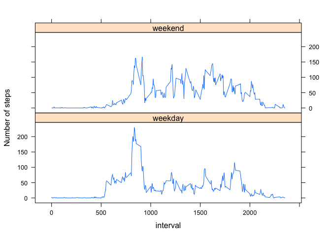

## Loading and preprocessing the data

Following these steps:  

1. Unzip the zip folder to get the csv file

2. Read in the csv file and save it to a variable called "activity". 


```r
unzip("activity.zip")
activity <- read.csv("activity.csv")
```


## What is mean total number of steps taken per day?

1. Group the data frame by date and summarize the total steps for each day.


```r
# calculate total steps each day. 
totalsteps <- group_by(activity, date) %>%
              summarise(total_step = sum(steps, na.rm = TRUE),.groups = 'drop')

#show the first few rows of the resulting data frame
head(totalsteps)
```

```
## # A tibble: 6 x 2
##   date       total_step
##   <fct>           <int>
## 1 2012-10-01          0
## 2 2012-10-02        126
## 3 2012-10-03      11352
## 4 2012-10-04      12116
## 5 2012-10-05      13294
## 6 2012-10-06      15420
```

2. Create a histogram of the total steps taken each day. 

```r
hist(totalsteps$total_step)
```

<!-- -->

3. Calculate the mean and median of the total number of steps taken per day. 


```r
mean_total_steps <- mean(totalsteps$total_step)
median_total_steps <- median(totalsteps$total_step)
```

The mean of the total number of steps taken per day is 9354, and the median of the total number of steps taken per day is 10395.  

## What is the average daily activity pattern?

1. Make a time series plot (i.e. type = "l") of the 5-minute interval (x-axis) and the average number of steps taken, averaged across all days (y-axis)


```r
# calculate average steps each interval. 
averagesteps <- group_by(activity, interval) %>%
                summarise(average_step = mean(steps, na.rm = TRUE),.groups = 'drop')

#Make the line plot
plot(averagesteps$interval, averagesteps$average_step,
     type = "l", 
     xlab = "Time",
     ylab = "Number of Steps Taken",
     main = "Average number of steps taken in each 5-min interval")
```

<!-- -->

2. Which 5-minute interval, on average across all the days in the dataset, contains the maximum number of steps?

```r
averagesteps$interval[which.max(averagesteps$average_step)]
```

```
## [1] 835
```

## Imputing missing values
1. Calculate and report the total number of missing values in the dataset (i.e. the total number of rows with NAs)


```r
#Count how many rows do not have NAs with the complete.case() function.
#Subtract that from the total number of rows to get the number of rows with NAs. 
nrow(activity) - sum(complete.cases(activity))
```

```
## [1] 2304
```

```r
#Alternatively we could only look for NAs in the steps column. Both approaches generate the same answer for this dataset. 
sum(is.na(activity$steps))
```

```
## [1] 2304
```


2. Devise a strategy for filling in all of the missing values in the dataset. The strategy does not need to be sophisticated. For example, you could use the mean/median for that day, or the mean for that 5-minute interval, etc.


```r
#create a data frame with the means for the 5-min intervals.
fillin <- sapply(split(activity$steps, activity$interval), mean, na.rm=TRUE)

fillin <- cbind.data.frame(names(fillin), round(fillin, digits = 3))
colnames(fillin) <- c("interval", "fillin_steps")
```

3. Create a new dataset that is equal to the original dataset but with the missing data filled in.


```r
#join the fillin data frame to activity
activity_new <- merge(activity, fillin)

#if steps is NA, fill it in with the value from fillin_steps column. 
activity_new$steps <- ifelse(is.na(activity_new$steps), 
                             activity_new$fillin_steps, 
                             activity_new$steps)

#rearrange the order to be by date. 
activity_new <- arrange(activity_new, date)

head(activity_new)
```

```
##   interval steps       date fillin_steps
## 1        0 1.717 2012-10-01        1.717
## 2        5 0.340 2012-10-01        0.340
## 3       10 0.132 2012-10-01        0.132
## 4       15 0.151 2012-10-01        0.151
## 5       20 0.075 2012-10-01        0.075
## 6       25 2.094 2012-10-01        2.094
```


4. Make a histogram of the total number of steps taken each day and calculate and report the mean and median total number of steps taken per day. Do these values differ from the estimates from the first part of the assignment? What is the impact of imputing missing data on the estimates of the total daily number of steps?


```r
totalsteps_new <- group_by(activity_new, date) %>%
              summarise(total_step = sum(steps, na.rm = TRUE),.groups = 'drop')
hist(totalsteps_new$total_step)
```

<!-- -->

```r
mean_total_steps_new <- mean(totalsteps_new$total_step)
median_total_steps_new <- median(totalsteps_new$total_step)
```
 

The mean of the total number of steps taken per day is 1.0766\times 10^{4}, and the median of the total number of steps taken per day is 1.0766\times 10^{4}.  

After imputing the missing data, fewer days are outliers. Most of the days converge to the middle in terms of total number of steps. The overal distribution looks more like a normal distribution, which is also manifested in the converging mean and median.

## Are there differences in activity patterns between weekdays and weekends?

1. Create a new factor variable in the dataset with two levels – “weekday” and “weekend” indicating whether a given date is a weekday or weekend day.


```r
#Add a column called wday
activity_new$wday <- wday(activity_new$date, 
                          week_start = getOption("lubridate.week.start", 1))

#divide the values in the wday columns into "weekend" and "weekday"
for (i in 1:nrow(activity_new)){
    if(activity_new$wday[i] > 5) {
        activity_new$weekday[i] <- "weekend"
    } else{
        activity_new$weekday[i] <- "weekday"
    }
}

# convert the column from character to factor.
activity_new$weekday <- as.factor(activity_new$weekday)
```

2. Make a panel plot containing a time series plot (i.e. type = "l") of the 5-minute interval (x-axis) and the average number of steps taken, averaged across all weekday days or weekend days (y-axis). See the README file in the GitHub repository to see an example of what this plot should look like using simulated data.


```r
averagesteps_new <- group_by(activity_new, weekday, interval) %>%
                    summarise(average_step = mean(steps))
```

```
## `summarise()` regrouping output by 'weekday' (override with `.groups` argument)
```

```r
xyplot(average_step ~ interval | weekday, 
       data = averagesteps_new,
       type = "l",
       layout = c(1, 2),
       ylab = "Number of steps")
```

<!-- -->


